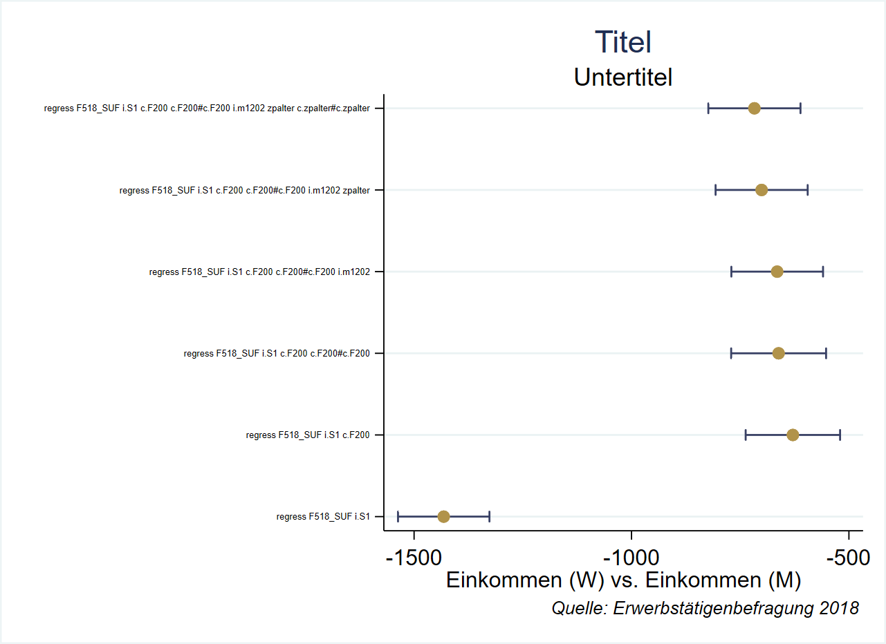

# Regressionsergebnisse weiterverarbeiten {#regres}

```{r setup3, echo = F, message=F, warning = F}
if(Sys.getenv("USERNAME") == "filse" ) .libPaths("D:/R-library4")  # set library
# stataexe <- "C:/Program Files (x86)/Stata13/StataSE-64.exe"
stataexe <- "C:/Program Files/Stata16/StataSE-64.exe"
knitr::opts_chunk$set(engine.path=list(stata=stataexe))
library(Statamarkdown)
library(kableExtra)
library(magrittr)
# library(tidyverse)
# library(ggthemes)
```


## `e()` und `r()` der Regressionsergebnisse

Die Koeffizienten und Standardfehler des letzten Modells werden in `e()` gespeichert:
```{stata reg00,eval = F}
reg F518_SUF F200
```
```{stata reg01,echo = F}
qui use "D:\Datenspeicher\BIBB_BAuA/BIBBBAuA_2018_suf1.0.dta", clear
quietly{
  mvdecode F518_SUF, mv( 99998/ 99999)
  mvdecode zpalter, mv(9999)
  mvdecode F200, mv( 97/99)
  mvdecode m1202, mv(-1)
}
reg F518_SUF F200
```


```{stata reg01b,eval = F}
mat l e(b)
```
```{stata reg01c,echo = F}
qui use "D:\Datenspeicher\BIBB_BAuA/BIBBBAuA_2018_suf1.0.dta", clear
quietly{
  mvdecode F518_SUF, mv( 99998/ 99999)
  mvdecode zpalter, mv(9999)
  mvdecode F200, mv( 97/99)
  mvdecode m1202, mv(-1)
  reg F518_SUF F200
}
mat l e(b)
```

### Koeffizienten mit `_b` / `_se` aufrufen

Allerdings gibt es noch eine Abkürzung mit `_b[varname]` bzw. `_se[varname]`:

```{stata reg02, eval = F}
dis "Der Koeffizient für F200 ist " _b[F200]
dis "Der Standardfehler des Koeffizienten für F200 ist " _se[F200]
```
```{stata reg02b,echo = F}
qui use "D:\Datenspeicher\BIBB_BAuA/BIBBBAuA_2018_suf1.0.dta", clear
quietly{
  mvdecode zpalter, mv(9999)
mvdecode F518_SUF, mv( 99998/ 99999)
mvdecode F200, mv( 97/99)
mvdecode m1202, mv(-1)
reg F518_SUF F200
}
dis "Der Koeffizient für F200 ist " _b[F200]
dis "Der Standardfehler des Koeffizienten für F200 ist " _se[F200]
```

Wir können so auch vorhergesagte Werte berechnen - entweder für spezifische Werte:
```{stata reg03, eval= F}
dis _b[_cons] + 20 *_b[F200]
margins, at(F200 = 20)
```
```{stata reg03b, echo= F}
qui use "D:\Datenspeicher\BIBB_BAuA/BIBBBAuA_2018_suf1.0.dta", clear
quietly{
  mvdecode zpalter, mv(9999)
mvdecode F518_SUF, mv( 99998/ 99999)
mvdecode F200, mv( 97/99)
mvdecode m1202, mv(-1)
reg F518_SUF F200
}
dis _b[_cons] + 20 *_b[F200]
margins, at(F200 = 20) noatlegend
```

...oder für alle Beobachtungen:
```{stata reg04, eval= F}
gen pred_manual = _b[_cons] + F200 *_b[F200]
predict pred_auto, xb
gen diff=  pred_manual - pred_auto
su diff
```
```{stata reg04b, echo= F}
qui use "D:\Datenspeicher\BIBB_BAuA/BIBBBAuA_2018_suf1.0.dta", clear
quietly{
  mvdecode zpalter, mv(9999)
  mvdecode F518_SUF, mv( 99998/ 99999)
  mvdecode F200, mv( 97/99)
  mvdecode m1202, mv(-1)
  reg F518_SUF F200
  gen pred_manual = _b[_cons] + F200 *_b[F200]
  predict pred_auto, xb
  gen diff=  pred_manual - pred_auto
}
su diff
```


### Komplette Regressionstabelle

Die vollständige Regressionstabelle ist aber eine r-Class matrix:
```{stata regtab1, eval = F}
reg F518_SUF F200
matlist r(table) 
```
```{stata regtab2, echo= F}
qui use "D:\Datenspeicher\BIBB_BAuA/BIBBBAuA_2018_suf1.0.dta", clear
quietly{
  mvdecode zpalter, mv(9999)
  mvdecode F518_SUF, mv( 99998/ 99999)
  mvdecode F200, mv( 97/99)
  mvdecode m1202, mv(-1)
  reg F518_SUF F200
}
mat list r(table) 
```

## Regressionstabellen als `matrix` speichern und anpassen

Mit `'` können wir die Regressionstabelle transponieren:
```{stata regmat, eval = F}
reg F518_SUF F200
mat C = r(table)'
mat l C
```
```{stata regmat2, echo= F}
qui use "D:\Datenspeicher\BIBB_BAuA/BIBBBAuA_2018_suf1.0.dta", clear
quietly{
  mvdecode zpalter, mv(9999)
  mvdecode F518_SUF, mv( 99998/ 99999)
  mvdecode F200, mv( 97/99)
  mvdecode m1202, mv(-1)
  reg F518_SUF F200
  mat C = r(table)'
}
mat l C 
```

[rownumb](#crnumb) hilft, einen Koeffizienten zu suchen:
```{stata regmat3, eval = F}
mat C1 = C[rownumb(C,"F200"),1...]
mat l C1
```

```{stata regmat4, echo= F}
qui use "D:\Datenspeicher\BIBB_BAuA/BIBBBAuA_2018_suf1.0.dta", clear
quietly{
  mvdecode zpalter, mv(9999)
  mvdecode F518_SUF, mv( 99998/ 99999)
  mvdecode F200, mv( 97/99)
  mvdecode m1202, mv(-1)
  reg F518_SUF F200
  mat C = r(table)'
  mat C1 = C[rownumb(C,"F200"),1...]
}
mat l C1
```


## kategoriale UV

Der Koeffizientenname ist etwas komplizierterer Name bei kat. UVs:
```{stata katuv1,eval = F}
reg F518_SUF i.S1 F200
ereturn list
mat l r(table) 
dis "Der Koeffizient für S1 = weiblich ist " _b[2.S1]
```


```{stata katuv01,echo = F}
qui use "D:\Datenspeicher\BIBB_BAuA/BIBBBAuA_2018_suf1.0.dta", clear
quietly{
  mvdecode zpalter, mv(9999)
  mvdecode F518_SUF, mv( 99998/ 99999)
  mvdecode F200, mv( 97/99)
  mvdecode m1202, mv(-1)
  reg F518_SUF i.S1 F200
}
mat l r(table) 
dis "Der Koeffizient für S1 = weiblich ist " _b[2.S1]
```

Dies müssen wir auch bei der Suche nach einem Koeffizienten berücksichtigen:
```{stata katuv2,eval = F}
mat D = r(table)' // transponieren:
mat l D
```


```{stata katuv3,eval = F}
                b          se           t      pvalue          ll          ul          df        crit       eform
1b.S1           0           .           .           .           .           .       14656   1.9601259           0
 2.S1  -628.91281   55.392637  -11.353726   9.461e-30  -737.48935  -520.33627       14656   1.9601259           0
 F200    95.08006   3.2038116    29.67717   5.23e-188   88.800186   101.35993       14656   1.9601259           0
_cons   464.42184   125.90363    3.688709   .00022621   217.63489    711.2088       14656   1.9601259           0
```


## Als Datensatz ablegen:

Auch hier können wir dann mit `xsvmat` die Matrix in einen Datensatz umformatieren:
```{stata regframe, eval = F}
cap frame drop regres1
xsvmat D,  names(col) rownames(coef) frame(regres1)
frame change regres1

list, noobs clean
```

```{stata list, eval = F}
 coef           b         se           t     pvalue          ll          ul      df       crit   eform  
1b.S1           0          .           .          .           .           .   14656   1.960126       0  
 2.S1   -628.9128   55.39264   -11.35373   9.46e-30   -737.4893   -520.3362   14656   1.960126       0  
 F200    95.08006   3.203812    29.67717          0    88.80019    101.3599   14656   1.960126       0  
_cons    464.4218   125.9036    3.688709   .0002262    217.6349    711.2088   14656   1.960126       0  
```

## weitere Infos aus `e()`

In `ereturn list` oben sehen wir, dass `e(cmdline)` den `reg`-Befehl enthält:

```{stata elist, eval = F}
 reg F518_SUF i.S1 F200
dis "`e(cmdline)'"
```

```{stata elistreg,echo = F}
quietly{
 use "D:\Datenspeicher\BIBB_BAuA/BIBBBAuA_2018_suf1.0.dta", clear
  mvdecode zpalter, mv(9999)
  mvdecode F518_SUF, mv( 99998/ 99999)
  mvdecode F200, mv( 97/99)
  mvdecode m1202, mv(-1)
  reg F518_SUF i.S1 F200
}
dis "`e(cmdline)'"
```

Diese Information können wir mit in den Ergebnis-`frame` nehmen. `global`s bleiben nehmen in der Session erhalten, auch wenn wir zwischen `frame`s wechseln:

```{stata cmd1, eval = F}
gen mo = "`e(cmdline)'"
list, noobs clean
```


```{stata cmd2, eval = F}
 coef           b         se           t     pvalue          ll          ul      df       crit   eform                           mo  
1b.S1           0          .           .          .           .           .   14656   1.960126       0   regress F518_SUF i.S1 F200  
 2.S1   -628.9128   55.39264   -11.35373   9.46e-30   -737.4893   -520.3362   14656   1.960126       0   regress F518_SUF i.S1 F200  
 F200    95.08006   3.203812    29.67717          0    88.80019    101.3599   14656   1.960126       0   regress F518_SUF i.S1 F200  
_cons    464.4218   125.9036    3.688709   .0002262    217.6349    711.2088   14656   1.960126       0   regress F518_SUF i.S1 F200  
```

Diese Beschreibung ist natürlich alles andere als ideal. Im nächsten Kapitel werden wir einige Möglichkeiten kennenlernen, da etwas zu ändern.


***

**[Übung](#reg1)**

***


### `e(sample)`

`e(sample)` ist eine `e()`-Class Funktion, welche die in einem Modell berücksichtigten Fälle zu markieren:
```{stata esmpl1, eval = F}
quietly reg F518_SUF i.S1 F200
gen smpl = e(sample)
tab sampl
```


```{stata esmpl2s, echo = F}
quietly{
 use "D:\Datenspeicher\BIBB_BAuA/BIBBBAuA_2018_suf1.0.dta", clear
  mvdecode zpalter, mv(9999)
  mvdecode F518_SUF, mv( 99998/ 99999)
  mvdecode F200, mv( 97/99)
  mvdecode m1202, mv(-1)
  reg F518_SUF i.S1 F200
quietly reg F518_SUF i.S1 F200
}
gen smpl = e(sample)
tab smpl
```

So können wir bspw. sehen, wo die Missings liegen:
```{stata mcsampl, eval = F}
mdesc  F518_SUF S1 F200 if smpl == 0
```


```{stata mcsampl2}
quietly{
  use "./data/BIBBBAuA_2018_suf1.0_clean.dta", replace 
  reg F518_SUF i.S1 F200
  gen smpl = e(sample)
}
mdesc  F518_SUF S1 F200 if smpl == 0
```


## `reg` schrittweise aufbauen

```{stata regestp,eval = F}
glo mod1 i.S1 az i.m1202 zpalter i.Mig
qui regress F518_SUF ${mod1}
gen smpl2 = e(sample)

local len2: word count ${mod1}
forvalues i = 1(1)`len2' {
    loc word: word `i' of ${mod1}
    dis "Modell Nr" `i' ": mit `word'"
	loc x `x' `word'
	qui reg F518_SUF `x' if smpl2 == 1
	est store m`i'
}

est dir
esttab m*, b se  // ssc install esttab
```


```{stata regstep2,echo = F}
quietly{
  set linesize 200
  use "./data/BIBBBAuA_2018_suf1.0_clean.dta", replace 
  reg F518_SUF i.S1 F200
}
glo mod1 i.S1 az i.m1202 zpalter i.Mig
qui regress F518_SUF ${mod1}
gen smpl2 = e(sample)

local len2: word count ${mod1}
forvalues i = 1(1)`len2' {
    loc word: word `i' of ${mod1}
    dis "Modell Nr" `i' ": mit `word'"
	loc x `x' `word'
	qui reg F518_SUF `x' if smpl2 == 1
	est store m`i'
}

est dir
esttab m*, b se // ssc install esttab
```

***

**[Übung](#reg2)**

***


## Übungen


### Übung {#reg1}

Erstellen Sie folgendes Regressionsmodell:
```{stata, eval = F}
reg az i.mig01 zpalter
```
(In `mig01` steht dann 0 für keinen Migrationshintergrund und 1 für Migrationshintergrund - siehe auch `01_init.do`)

+ Erstellen Sie jeweils einen `display`-Befehl, der den Koeffizienten und Standardfehler für `mig01` und `zpalter` mit einer Aussagekräftigen Nachricht ausgibt
+ Wie würde das als Schleife über die Koeffizienten aussehen?
+ Extrahieren Sie die Regressionstabelle als `matrix` und legen sie diese als `frame` ab.
+ Erstellen Sie zusätzlich eine Spalte mit dem Regressionsbefehl.

### Übung {#reg2}

Bauen Sie folgendes Modell Schritt für Schritt auf und lassen Sie sich die Tabelle mit `esttab` ausgeben:
```{stata, eval = F}
reg az i.S1 zpalter c.zpalter#c.zpalter i.gkpol i.F1604 i.F1604##i.S1
```


## Anhang

### `statsby`

```{stata, eval = F}
statsby _b _se, by(Bula) noisily: ///
	regress F518_SUF c.F200##c.F200 i.m1202 i.S1
```


### `reg`-Ergebnisse für Modelle sammeln: Schleife

Wir können mit den `matrix`-Befehlen auch eine Schleife bauen, welche eine Reihe an Regressionsmodellen schätzt und bei jedem Durchlauf einen zusätzlichen Term hinzunimmt.
Wir interessieren uns aber nur, dafür wie sich der Koeffizient für das Geschlecht (S1 == 2) entwickelt mit jedem neuen Modell.
Mit den `matrix`-Befehlen können wir dieser herausfiltern.

```{stata regloop0, eval = F}
local predictors i.S1 c.F200 c.F200#c.F200 i.m1202 zpalter c.zpalter#c.zpalter // UV-Liste
local r = 1 // Zähler 
loc uv 		// uv rücksetzen (zur sicherheit)
foreach v of local predictors {
  local uv `uv' `v'
	qui regress F518_SUF `uv'
	mat D = r(table)'						// reg-tabelle transponieren & speichern 
	mat D2 = D[rownumb(D,"2.S1"),1...]		// Koeffizient für S1=2 behalten
	
	if (`r' == 1) mat R = D2 				// im ersten Durchlauf R erstellen
	if (`r' != 1) mat R = R\D2 				// danach: D2 an R anfügen
		
	loc ++r // Zähler + 1
}
mat l R
```


```{stata regloop01, eval = F}
R[6,9]
               b          se           t      pvalue          ll          ul          df        crit       eform
2.S1  -1431.8093   53.630001  -26.697917   8.52e-154  -1536.9298  -1326.6888       16633   1.9601066           0
2.S1  -628.91281   55.392637  -11.353726   9.461e-30  -737.48935  -520.33627       14656   1.9601259           0
2.S1   -661.6656   55.679749  -11.883416   2.034e-32  -770.80492  -552.52628       14655   1.9601259           0
2.S1  -664.94219   53.793012  -12.361126   6.336e-35  -770.38328  -559.50111       14633   1.9601261           0
2.S1  -700.71303   54.028438  -12.969337   2.975e-38  -806.61563  -594.81043       14552    1.960127           0
2.S1  -717.33567   54.061055  -13.268991   5.977e-40  -823.30221  -611.36914       14551    1.960127           0

```
Wie wissen wir jetzt, für was kontrolliert wurde?

Wir nutzen den Zähler, um ein `global` mit der Zählernummer zu erstellen und eine Zeile in die `matrix` einzufügen:
```{stata regloop1, eval = F}
local predictors i.S1 c.F200 c.F200#c.F200 i.m1202 zpalter c.zpalter#c.zpalter
local r = 1 // Zähler 
loc uv 		// uv rücksetzen (zur sicherheit)
foreach v of local predictors {
    local uv `uv' `v'
	qui regress F518_SUF `uv'
	mat D = r(table)'						// reg-tabelle transponieren & speichern 
	mat D2 = D[rownumb(D,"2.S1"),1...]		// Koeffizient für S1=2 behalten
	
	mat M = `r'
	mat colname M = mod
	
	if (`r' == 1) mat R = D2 , M			// ,r -> zähler an Koeffizientzeile anfügen
	if (`r' != 1) mat R = R\(D2 , M)
	glo cmd`r' = "`e(cmdline)'"
	loc ++r // Zähler + 1
}
mat l R
```


```{stata regloop11, eval = F}
R[6,10]
               b          se           t      pvalue          ll          ul          df        crit       eform         mod
2.S1  -1431.8093   53.630001  -26.697917   8.52e-154  -1536.9298  -1326.6888       16633   1.9601066           0           1
2.S1  -628.91281   55.392637  -11.353726   9.461e-30  -737.48935  -520.33627       14656   1.9601259           0           2
2.S1   -661.6656   55.679749  -11.883416   2.034e-32  -770.80492  -552.52628       14655   1.9601259           0           3
2.S1  -664.94219   53.793012  -12.361126   6.336e-35  -770.38328  -559.50111       14633   1.9601261           0           4
2.S1  -700.71303   54.028438  -12.969337   2.975e-38  -806.61563  -594.81043       14552    1.960127           0           5
2.S1  -717.33567   54.061055  -13.268991   5.977e-40  -823.30221  -611.36914       14551    1.960127           0           6
```

Diese `matrix` R schicken wir jetzt in einen `frame`:
```{stata regloop2, eval = F}
cap frame drop rmods
xsvmat R,  names(col) rownames(coef) frame(rmods)
frame change rmods

list, noobs clean
```


```{stata regloop02, eval = F}
coef           b         se           t     pvalue          ll          ul      df       crit   eform   mod  
2.S1   -1431.809      53.63   -26.69792          0    -1536.93   -1326.689   16633   1.960107       0     1  
2.S1   -628.9128   55.39264   -11.35373   9.46e-30   -737.4893   -520.3362   14656   1.960126       0     2  
2.S1   -661.6656   55.67975   -11.88342   2.03e-32   -770.8049   -552.5263   14655   1.960126       0     3  
2.S1   -664.9422   53.79301   -12.36113   6.34e-35   -770.3833   -559.5011   14633   1.960126       0     4  
2.S1    -700.713   54.02844   -12.96934   2.97e-38   -806.6156   -594.8104   14552   1.960127       0     5  
2.S1   -717.3357   54.06105   -13.26899          0   -823.3022   -611.3691   14551   1.960127       0     6  
```

Jetzt wissen zwar schon mal, aus welchem Modell der Koeffizient jeweils kommt (basierend auf `mod`). 
Eigentlich würden das aber gerne labeln.
Dazu können wir jetzt auf die `globals` zurückgreifen - mit [`all globals`](#allglo) können wir nach ihnen suchen:
```{stata regloop3, eval = F}
global allglo:  all globals "cmd*"
mac l allglo
allglo:         cmd6 cmd5 cmd4 cmd3 cmd2 cmd1
```

```{stata regloop03, eval = F}
mac l cmd1
cmd1:           regress F518_SUF i.S1
```

Jetzt können wir mit einer Schleife die Spalte `mod` labeln. 
Mit `label define ....` können Wertelabels erstellt werden - mit der Option `,modify` können wir das auch schrittweise verändern. 
Außerdem können wir einen kleinen Trick nutzen, um innerhalb der Schleife auf das `global` mit einer bestimmten Zahl zuzugreifen: 
```{stata regloop4, eval = F}
levelsof mod, loc(mnrs)
  foreach m of local mnrs {
  	lab def mod_lab `m' "${cmd`m'}", modify // value label verändern 
  }
lab val mod mod_lab

list, noobs clean
```

```{stata regloop04, eval = F}
    coef           b         se           t     pvalue          ll          ul      df       crit   eform                                                                              mod  
    2.S1   -1431.809      53.63   -26.69792          0    -1536.93   -1326.689   16633   1.960107       0                                                            regress F518_SUF i.S1  
    2.S1   -628.9128   55.39264   -11.35373   9.46e-30   -737.4893   -520.3362   14656   1.960126       0                                                     regress F518_SUF i.S1 c.F200  
    2.S1   -661.6656   55.67975   -11.88342   2.03e-32   -770.8049   -552.5263   14655   1.960126       0                                       regress F518_SUF i.S1 c.F200 c.F200#c.F200  
    2.S1   -664.9422   53.79301   -12.36113   6.34e-35   -770.3833   -559.5011   14633   1.960126       0                               regress F518_SUF i.S1 c.F200 c.F200#c.F200 i.m1202  
    2.S1    -700.713   54.02844   -12.96934   2.97e-38   -806.6156   -594.8104   14552   1.960127       0                       regress F518_SUF i.S1 c.F200 c.F200#c.F200 i.m1202 zpalter  
    2.S1   -717.3357   54.06105   -13.26899          0   -823.3022   -611.3691   14551   1.960127       0   regress F518_SUF i.S1 c.F200 c.F200#c.F200 i.m1202 zpalter c.zpalter#c.zpalter  

```

Daraus können wir beispielsweise einen Koeffizientenplot erstellen:
```{stata reggraph, eval = F}
graph twoway ///
	(rcap ll ul mod,horizontal lcolor("57 65 101") ) /// Konfidenzintervalle
	(scatter mod b,  mcolor("177 147 74") )  , /// Punktschätzer
	graphregion(fcolor(white)) /// Hintergundfarbe (außerhalb des eigentlichen Plots)
	ylabel(, valuelabel angle(0) labsize(tiny)) ///
	legend(off) ///
	xtitle("Einkommen (W) vs. Einkommen (M)") /// Achsentitel
	ytitle("") /// 
	title("Titel")  ///
	subtitle("Untertitel") ///
	caption("{it:Quelle: Erwerbstätigenbefragung 2018}", size(8pt) position(5) ring(5) )
```


```{r,echo = F, out.height="80%",out.width="80%", fig.align="center"}

```

Diese labels sind natürlich alles andere als ideal. Im nächsten Kapitel werden wir einige Möglichkeiten kennenlernen, da etwas zu ändern.

