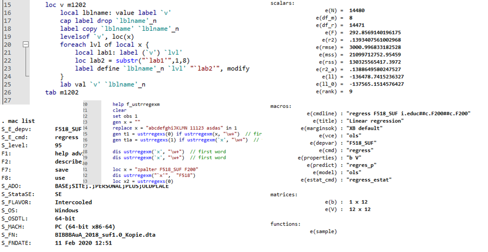

# Programmieren mit Stata

------------------------------------------------------------------------

 
<!-- {fig-align="center" width="482"} ---> 

Eintätiger Kurs am BIBB zum Programmieren in Stata mit

-   Macros: `global` & `local` erstellen und verwenden
-   Postestimates: `e()` und `r()` aufrufen und weiterverwenden
-   `foreach`: Schleifen aufbauen und verwenden
-   Label- und Variablenfunktionen (`extended macro functions`)
-   DoFiles anstoßen: Arbeiten mit einem Master-DoFile
-   Dateiverwaltung mit Stata (`dir files`)

Vollständiges Skript [**hier**](https://filius23.github.io/StataProgBIBB_2022/)

Bei Fragen, Anmerkungen oder Interesse freue ich mich über Nachrichten: andreas.filser\[at\]uol.de

------------------------------------------------------------------------

One-day seminar on programming in Stata (in German) using

-   Macros: creating and using `global` & `local`
-   Postestimates: calling and using `e()` und `r()`
-   How to programm efficient loops (`foreach`)
-   Label & rename variables using `extended macro functions`
-   Run DoFiles using a main dofile
-   Automated data import and file organization via Stata

Contact me if you're interested to learn more: andreas.filser\[at\]uol.de
